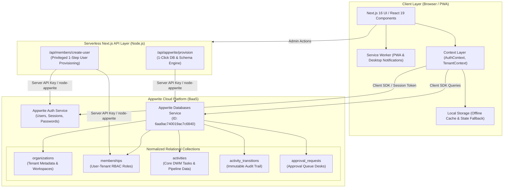
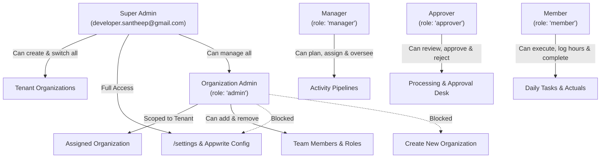
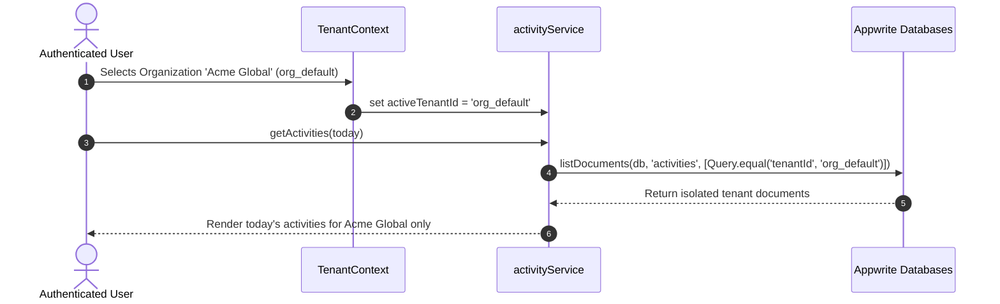

# System Architecture Document

## 1. Executive Architecture Summary

The **Daily Work Management (DWM) WorkHub** is an enterprise multi-tenant task orchestration and activity management platform. It enables organizations to plan daily work, enforce governance workflows, monitor aging work items, and streamline cross-functional approvals across HR, Payroll, Compliance, and Operations pipelines.

The platform is built using a modern **hybrid cloud serverless architecture**:
- **Client Application**: Next.js 16.3 (React 19, Tailwind CSS, TypeScript, Turbopack).
- **Backend-as-a-Service (BaaS)**: Appwrite Cloud (`fra.cloud.appwrite.io`) providing Session Authentication, JSON Document Databases, and File Storage.
- **Serverless API Routes**: Next.js App Router route handlers for privileged server-side orchestration (e.g. 1-step user account creation, automated database schema provisioning via `node-appwrite`).
- **Offline & Local Fallback**: Client-side reactive persistence ensuring offline resiliency and immediate UI responsiveness.

---

## 2. High-Level Architecture Diagram

---

## 3. Core Architectural Components

### 3.1 Frontend Layer (Next.js 16 App Router)
- **App Router Architecture**:
  - `/` — Today's Daily Work Plan, completion tracker, quick filters, and interactive modals.
  - `/plan-vs-actual` — Variance analysis, hour logging, and CSV audit export.
  - `/approvals` — Dedicated multi-tier approval desk (Pending, Approved, Changes Requested).
  - `/schedule` — 7-Day rolling forward agenda with upcoming activity scheduler.
  - `/analytics` — Aging analysis (Long Pending >3 Days, Stalled Processing >2 Days), status distribution.
  - `/settings` — **Super Admin Only** infrastructure settings, credentials form, 1-click database provisioning.
  - `/login` — Credential-based authentication with Appwrite session initialization.
- **Styling & UI Components**: Tailwind CSS v4, Lucide React icons, accessible dialogs, and responsive mobile dock navigation.

### 3.2 Security & Multi-Tenant Role-Based Access Control (RBAC)

The application enforces a multi-tier authorization hierarchy both in the UI and at the service/API layers:

#### Authorization Matrix:
| Feature / Action | Super Admin | Organization Admin | Manager | Approver | Member |
| :--- | :---: | :---: | :---: | :---: | :---: |
| **Create New Organization** | ✅ | ❌ | ❌ | ❌ | ❌ |
| **Switch Between Organizations** | ✅ | ❌ | ❌ | ❌ | ❌ |
| **Access `/settings` (Backend Config)**| ✅ | ❌ | ❌ | ❌ | ❌ |
| **Manage Team Members (Invite/Remove)**| ✅ | ✅ | ❌ | ❌ | ❌ |
| **Assign Roles (`admin`, `manager`, etc.)**| ✅ | ✅ | ❌ | ❌ | ❌ |
| **Create / Edit Planned Activities** | ✅ | ✅ | ✅ | ❌ | ❌ |
| **Submit Activity to Approvals** | ✅ | ✅ | ✅ | ❌ | ❌ |
| **Approve / Reject Requests** | ✅ | ✅ | ❌ | ✅ | ❌ |
| **Log Actual Hours & Complete Tasks** | ✅ | ✅ | ✅ | ✅ | ✅ |

---

## 4. Multi-Tenant Data Isolation Strategy

Data isolation across tenants is achieved through logical multi-tenancy enforced at the query and service levels:

1. **Every record contains `tenantId`**:
   - Every document created in `activities`, `memberships`, `activity_transitions`, and `approval_requests` carries a `tenantId` attribute referencing the parent organization slug/ID.
2. **Context-Bound Queries**:
   - `TenantContext` maintains the currently selected `currentTenant`.
   - All `activityService` operations inject `Query.equal('tenantId', activeTenantId)`.
3. **Audit Trail Immutability**:
   - State transitions write to `activity_transitions` with `tenantId`, actor ID, from/to states, and reasons. Records in this collection are append-only.

---

## 5. Notification & Background Reminder Engine

DWM features a **dual-layer notification engine**:
1. **In-App Reminder Banner ([src/components/ReminderBanner.tsx](file:///Users/santheep/Desktop/personal/activity/src/components/ReminderBanner.tsx))**:
   - Polls active activities every 30 seconds.
   - Calculates time remaining until planned start time and triggers earlier reminders (e.g. 10m, 15m, 30m, 1h in advance).
   - Provides 1-click **Postpone to Tomorrow** and **Acknowledge** actions.
2. **Web Push / Desktop Notification Service ([public/sw.js](file:///Users/santheep/Desktop/personal/activity/public/sw.js))**:
   - Service Worker registered on app initialization.
   - Dispatches native OS-level desktop notifications even when the browser tab is in the background.

---

## 6. Deployment & Environment Strategy

| Component | Target Runtime | Configuration |
| :--- | :--- | :--- |
| **Frontend & API Routes** | Next.js Server / Vercel / Node.js Container | Port 3000, Turbopack, Node 20+ |
| **Database & Auth** | Appwrite Cloud | Endpoint: `https://fra.cloud.appwrite.io/v1` Project: `6aa99c9c00092ebcef4e` Database: `6aa9ac740019ac7c6840` |
| **Automation Scripts** | Node.js CLI | `npm run setup:appwrite` |
| **Automated Testing** | Playwright Test Runner | Chromium, Headless & UI Modes |
