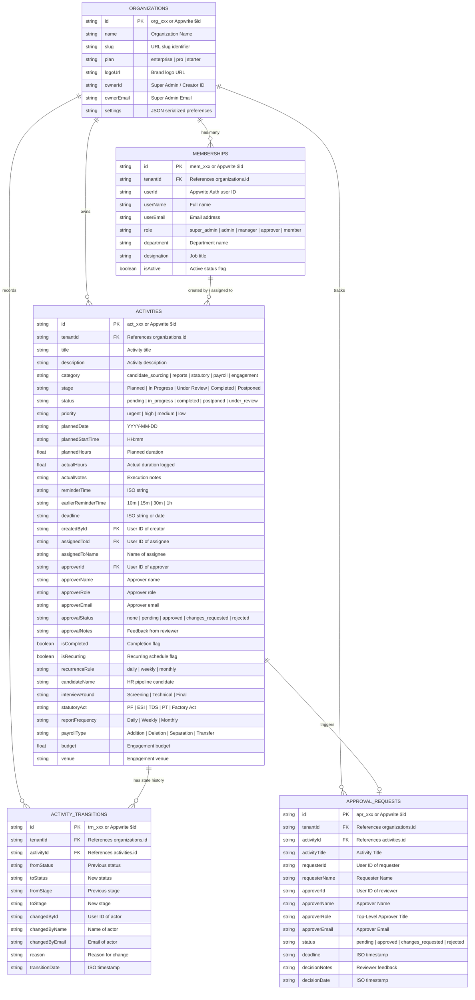

# Database Model & Entity-Relationship Diagram (ERD)

## 1. Overview

The **Daily Work Management (DWM)** database is built on **Appwrite Cloud** (`https://fra.cloud.appwrite.io/v1`, Database ID: `6aa9ac740019ac7c6840`).

To support enterprise multi-tenancy, strict RBAC, comprehensive state transition auditing, and multi-pipeline governance, the database is normalized across **5 relational collections**:
1. `organizations`: Tenant workspaces.
2. `memberships`: User-to-tenant memberships and role assignments.
3. `activities`: Scheduled and daily planned work items across all 5 pipelines.
4. `activity_transitions`: Append-only state transition audit logs.
5. `approval_requests`: Actionable approval desk entries.

---

## 2. Entity-Relationship Diagram (ERD)



---

## 3. Data Dictionary

### 3.1 Collection: `organizations`
| Attribute | Type | Size | Required | Default | Description |
| :--- | :--- | :---: | :---: | :---: | :--- |
| `name` | string | 100 | Yes | - | Display name of the organization |
| `slug` | string | 50 | Yes | - | URL-friendly unique tenant slug |
| `plan` | string | 30 | No | `enterprise` | Subscription tier |
| `logoUrl` | string | 500 | No | - | URL to organization brand logo |
| `ownerId` | string | 50 | No | - | Appwrite Auth ID of organization owner |
| `ownerEmail` | string | 100 | No | - | Email of the owner / Super Admin |
| `settings` | string | 5000 | No | - | JSON serialized configuration |

### 3.2 Collection: `memberships`
| Attribute | Type | Size | Required | Default | Description |
| :--- | :--- | :---: | :---: | :---: | :--- |
| `tenantId` | string | 50 | Yes | - | Foreign key to `organizations` |
| `userId` | string | 50 | Yes | - | Appwrite Auth user ID |
| `userName` | string | 100 | Yes | - | User display name |
| `userEmail` | string | 100 | Yes | - | Login email address |
| `role` | string | 30 | Yes | - | `super_admin`, `admin`, `manager`, `approver`, `member` |
| `department` | string | 50 | No | - | Operating department (e.g. HR, Payroll, Finance) |
| `designation` | string | 100 | No | - | Position / Title |
| `isActive` | boolean | - | No | `true` | Membership active status |

### 3.3 Collection: `activities`
| Attribute | Type | Size | Required | Default | Description |
| :--- | :--- | :---: | :---: | :---: | :--- |
| `tenantId` | string | 50 | No | `org_default` | Foreign key to `organizations` |
| `title` | string | 255 | Yes | - | Title of the work activity |
| `description` | string | 1000 | No | - | Detailed description and objectives |
| `category` | string | 50 | Yes | - | Pipeline category |
| `stage` | string | 50 | Yes | - | Current workflow stage |
| `status` | string | 50 | Yes | - | Lifecycle status |
| `priority` | string | 20 | Yes | `medium` | `urgent`, `high`, `medium`, `low` |
| `plannedDate` | string | 20 | Yes | - | Target execution date (`YYYY-MM-DD`) |
| `plannedStartTime`| string | 10 | No | - | Target execution time (`HH:mm`) |
| `plannedHours` | float | - | No | `1.0` | Allocated duration in hours |
| `actualHours` | float | - | No | `0.0` | Logged duration in hours |
| `actualNotes` | string | 2000 | No | - | Notes entered during hour logging |
| `reminderTime` | string | 50 | No | - | Scheduled reminder timestamp |
| `earlierReminderTime` | string | 50 | No | - | Advance alert window (`10m`, `15m`, etc.) |
| `deadline` | string | 50 | No | - | Hard deadline date/time |
| `createdById` | string | 50 | No | - | Author user ID |
| `assignedToId` | string | 50 | No | - | Assignee user ID |
| `assignedToName`| string | 100 | No | - | Assignee display name |
| `approverId` | string | 50 | No | - | Top-level approver user ID |
| `approverName` | string | 100 | No | - | Approver display name |
| `approverRole` | string | 100 | No | - | Approver corporate title |
| `approverEmail`| string | 100 | No | - | Approver email address |
| `approvalStatus`| string | 30 | No | `none` | `none`, `pending`, `approved`, etc. |
| `approvalNotes`| string | 2000 | No | - | Review feedback |
| `isCompleted` | boolean | - | No | `false` | Completion status |
| `isRecurring` | boolean | - | No | `false` | Recurrence indicator |
| `recurrenceRule`| string | 50 | No | - | Frequency rule |
| `candidateName`| string | 100 | No | - | HR sourcing candidate name |
| `interviewRound`| string | 50 | No | - | Candidate interview stage |
| `statutoryAct` | string | 100 | No | - | Compliance Act name |
| `reportFrequency`| string | 50 | No | - | Reporting frequency |
| `payrollType` | string | 50 | No | - | Payroll category |
| `budget` | float | - | No | `0.0` | Engagement activity budget |
| `venue` | string | 255 | No | - | Engagement activity venue |

### 3.4 Collection: `activity_transitions`
| Attribute | Type | Size | Required | Default | Description |
| :--- | :--- | :---: | :---: | :---: | :--- |
| `tenantId` | string | 50 | Yes | - | Foreign key to `organizations` |
| `activityId` | string | 50 | Yes | - | Foreign key to `activities` |
| `fromStatus` | string | 50 | Yes | - | Pre-transition status |
| `toStatus` | string | 50 | Yes | - | Post-transition status |
| `fromStage` | string | 50 | No | - | Pre-transition stage |
| `toStage` | string | 50 | No | - | Post-transition stage |
| `changedById` | string | 50 | Yes | - | User ID of actor who triggered transition |
| `changedByName` | string | 100 | Yes | - | Actor name |
| `changedByEmail`| string | 100 | No | - | Actor email |
| `reason` | string | 1000 | No | - | Explanation or comment |
| `transitionDate`| string | 50 | Yes | - | Timestamp of transition (`ISO 8601`) |

### 3.5 Collection: `approval_requests`
| Attribute | Type | Size | Required | Default | Description |
| :--- | :--- | :---: | :---: | :---: | :--- |
| `tenantId` | string | 50 | Yes | - | Foreign key to `organizations` |
| `activityId` | string | 50 | Yes | - | Foreign key to `activities` |
| `activityTitle`| string | 255 | Yes | - | Activity title |
| `requesterId` | string | 50 | Yes | - | Submitter user ID |
| `requesterName`| string | 100 | Yes | - | Submitter name |
| `approverId` | string | 50 | Yes | - | Reviewer user ID |
| `approverName` | string | 100 | Yes | - | Reviewer name |
| `approverRole` | string | 100 | No | - | Corporate title of reviewer |
| `approverEmail`| string | 100 | No | - | Reviewer email |
| `status` | string | 30 | Yes | `pending` | `pending`, `approved`, `changes_requested`, `rejected` |
| `deadline` | string | 50 | No | - | Approval deadline |
| `decisionNotes`| string | 2000 | No | - | Approver notes |
| `decisionDate` | string | 50 | No | - | Timestamp of approval decision |

---

## 4. Multi-Tenant Indexing & Performance Guidelines

To maintain sub-100ms response times at scale, the following composite indexes are provisioned on Appwrite:

| Collection | Index Key(s) | Type | Purpose |
| :--- | :--- | :---: | :--- |
| `activities` | `tenantId`, `plannedDate` | Key | Daily Plan & Schedule queries |
| `activities` | `tenantId`, `status` | Key | Aging & Summary queries |
| `activities` | `tenantId`, `category` | Key | Pipeline-specific dashboards |
| `memberships` | `tenantId`, `userEmail` | Unique | User lookup and authentication mapping |
| `activity_transitions` | `activityId`, `transitionDate` | Key | Audit trail history chronology |
| `approval_requests` | `tenantId`, `status`, `approverEmail` | Key | Filtered approval desk queues |

---

## 5. Automated Schema Provisioning

The database schema is fully automated and can be generated with a single command:
```bash
npm run setup:appwrite
```
The script [scripts/setup-appwrite.mjs](file:///Users/santheep/Desktop/personal/activity/scripts/setup-appwrite.mjs) handles:
1. Database creation (`databases.create`) if missing.
2. Collection creation (`databases.createCollection`) with full CRUD permissions.
3. Attribute creation (`createStringAttribute`, `createFloatAttribute`, `createBooleanAttribute`) with sizes, requirements, and default values.
4. Safe idempotent execution: only creates missing collections and attributes without overwriting existing data.
