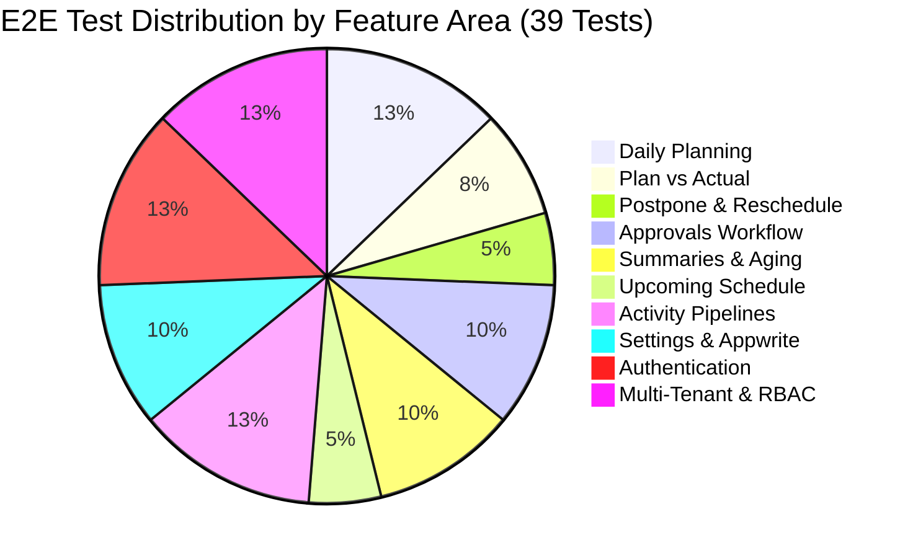

# End-to-End (E2E) Test Suites & Coverage Matrix

## 1. Overview

The Daily Work Management (DWM) platform is safeguarded by an automated **End-to-End (E2E) test suite** built on **[Playwright](https://playwright.dev/)** (`@playwright/test`).

The test suite covers the complete user lifecycle from authentication, multi-tenant switching, and role-based access control, to planning, postponing, approving, aging analysis, and Appwrite cloud provisioning.

---

## 2. Test Configuration & Test Helper

### 2.1 Configuration ([playwright.config.ts](file:///Users/santheep/Desktop/personal/activity/playwright.config.ts))
- **Base URL**: `http://localhost:3000`
- **Default Browser**: Chromium (Desktop Chrome viewport)
- **Web Server**: Automatically starts `npm run dev` and awaits port 3000 readiness before launching tests.
- **Artifacts**: Traces on first retry, screenshots on failure.

### 2.2 Test Helper & Session Seeding ([e2e/fixtures/test-helper.ts](file:///Users/santheep/Desktop/personal/activity/e2e/fixtures/test-helper.ts))
To ensure isolation and fast execution without relying on live network latency for every test assertion:
- `resetAppState(page)` resets `localStorage` state on each test.
- Pre-seeds active session with Super Admin credentials (`developer.santheep@gmail.com`).
- Sets active tenant to `org_default` (Acme Global Operations).

---

## 3. Comprehensive Test Matrix (10 Suites, 39 Tests)



---

### Suite 01: Daily Planning & Reminders
**File**: [`e2e/01-daily-planning.spec.ts`](file:///Users/santheep/Desktop/personal/activity/e2e/01-daily-planning.spec.ts)
| Test Case | Description & Assertions |
| :--- | :--- |
| `should display daily plan dashboard with summary metrics and date navigation` | Verifies header counters (Total, Completed, Pending, Time Spent) and confirms calendar date navigation updates the agenda. |
| `should create a new planned activity with reminder configured` | Opens the Add Activity modal, fills title, category, priority, planned time, and sets an earlier reminder (15m). Verifies card renders in agenda. |
| `should toggle activity completion and update counters` | Clicks the completion checkbox on an activity card, verifies visual strikethrough and confirms completed counter increments. |
| `should filter activities by category tabs and search query` | Switches category tabs (HR, Reports, Compliance, etc.) and types search terms in the filter bar, asserting matching items remain visible. |
| `should automatically carry forward uncompleted activities from yesterday to today with badge` | Seeds an uncompleted activity planned for yesterday, triggers rollover sentinel, and confirms the activity moves to today's agenda with the prominent `🔄 Carry Forwarded from [Date]` badge and state transition record. |

---

### Suite 02: Plan vs Actual Work Done
**File**: [`e2e/02-plan-vs-actual.spec.ts`](file:///Users/santheep/Desktop/personal/activity/e2e/02-plan-vs-actual.spec.ts)
| Test Case | Description & Assertions |
| :--- | :--- |
| `should display plan vs actual scorecards and table ledger` | Navigates to `/plan-vs-actual`. Verifies Planned Hours, Actual Hours, Variance, and Efficiency rate summary scorecards. |
| `should log actual work hours and calculate variance dynamically` | Opens the Log Actual Work modal for an activity, inputs 3.5h actual against 2.0h planned, asserts dynamic variance calculation (+1.5h overrun). |
| `should export plan vs actual report to CSV` | Clicks the "Export CSV" button, intercepts browser download event, and verifies CSV filename and non-empty content payload. |

---

### Suite 03: Postpone & Rescheduling
**File**: [`e2e/03-postpone-reminders.spec.ts`](file:///Users/santheep/Desktop/personal/activity/e2e/03-postpone-reminders.spec.ts)
| Test Case | Description & Assertions |
| :--- | :--- |
| `should postpone an activity to tomorrow with advance earlier reminder` | Clicks "Postpone" on a card, selects "Postpone to Tomorrow", selects a new reminder time, and verifies the activity moves to tomorrow's plan. |
| `should support rescheduling to custom date and verify in future plan` | Opens the postpone modal, selects a custom future date via datepicker, inputs postponement reason, and confirms card appears under that future date. |

---

### Suite 04: Approvals & Review Desks
**File**: [`e2e/04-approvals-workflow.spec.ts`](file:///Users/santheep/Desktop/personal/activity/e2e/04-approvals-workflow.spec.ts)
| Test Case | Description & Assertions |
| :--- | :--- |
| `should display approval queue tabs and approver filter` | Navigates to `/approvals`. Verifies tab switching across Pending, Approved, and Changes Requested queues. |
| `should filter approval items by Top-Level Approver` | Selects a specific Top-Level Approver (e.g. Finance Controller) and verifies the list filters to items assigned to that approver. |
| `should approve a pending task through top-level review desk` | Clicks "Approve" on a pending deliverable, inputs decision notes, and asserts status changes to Approved with success toast. |
| `should request changes on a workflow item` | Clicks "Request Changes", inputs reviewer feedback notes, and verifies the item moves to the "Changes Requested" queue. |

---

### Suite 05: Summaries & Aging Analytics
**File**: [`e2e/05-analytics-aging.spec.ts`](file:///Users/santheep/Desktop/personal/activity/e2e/05-analytics-aging.spec.ts)
| Test Case | Description & Assertions |
| :--- | :--- |
| `should display summary scorecards and switch between weekly and monthly timeframe` | Navigates to `/analytics`. Verifies Total Activities, Completion Rate, and Average Turnaround cards, and toggles Weekly/Monthly views. |
| `should display Long Pending (>3 Days) items with aging and action buttons` | Verifies the "Long Pending (>3 Days)" section surfaces delayed tasks with aging badges (e.g. `4 days aging`) and quick action buttons. |
| `should display Long Under Processing items with stalled badge` | Verifies deliverables stuck in review for over 48 hours are flagged with the `Stalled Processing` alert badge. |
| `should display category breakdown completion progress bars` | Checks that each of the 5 pipelines displays progress bars showing completed vs total task ratios. |

---

### Suite 06: Upcoming 7-Day Schedule
**File**: [`e2e/06-upcoming-schedule.spec.ts`](file:///Users/santheep/Desktop/personal/activity/e2e/06-upcoming-schedule.spec.ts)
| Test Case | Description & Assertions |
| :--- | :--- |
| `should display 7-day rolling agenda with multi-day cards` | Navigates to `/schedule`. Verifies that 7 consecutive days are rendered with their respective dates and activity counts. |
| `should schedule an upcoming activity for tomorrow` | Clicks "Schedule Activity" on tomorrow's column, enters title and time, and confirms the new task appears in that day's column. |

---

### Suite 07: Activity Pipelines
**File**: [`e2e/07-activity-pipelines.spec.ts`](file:///Users/santheep/Desktop/personal/activity/e2e/07-activity-pipelines.spec.ts)
| Test Case | Description & Assertions |
| :--- | :--- |
| `Pipeline 1: Candidate Sourcing pipeline with candidate fields` | Creates a Candidate Sourcing activity, verifies `candidateName` and `interviewRound` dropdowns work correctly. |
| `Pipeline 2: Reports pipeline with frequency and approval submission` | Creates a Management Report activity, verifies `reportFrequency` and Top-Level Approver assignment. |
| `Pipeline 3: Statutory Compliance with statutory act types` | Creates a Statutory Compliance activity, selects PF/ESI/TDS act type, and sets hard statutory deadline. |
| `Pipeline 4: Payroll pipeline supporting Addition, Deletion, Separation, Transfer` | Creates a Payroll change activity, selects `Addition` / `Separation` type, and verifies pipeline rendering. |
| `Pipeline 5: Engagement Activities with budget and venue` | Creates an Engagement activity, inputs budget (e.g. 50000) and venue, asserting financial and location attributes persist. |

---

### Suite 08: Settings & Appwrite Backend Security
**File**: [`e2e/08-settings-appwrite.spec.ts`](file:///Users/santheep/Desktop/personal/activity/e2e/08-settings-appwrite.spec.ts)
| Test Case | Description & Assertions |
| :--- | :--- |
| `should display Appwrite credentials form and test connection button` | Verifies Super Admin can view API Endpoint, Project ID, Database ID inputs, and "Test Connection" button. |
| `should display 1-Click Auto-Provision schema section` | Verifies the "Auto-Create All 25 Columns & Database" button and provisioning documentation are visible to Super Admin. |
| `should reset demo data and trigger success notification` | Clicks "Reset to Sample Data", confirms browser confirmation alert, and verifies success toast. |
| `should block non-super-admin users from accessing /settings and hide settings nav button` | Simulates a standard member session, asserts Settings icon is hidden from Navbar, and direct navigation to `/settings` triggers the **Restricted Access** guard. |

---

### Suite 09: Authentication & Session Guards
**File**: [`e2e/09-authentication.spec.ts`](file:///Users/santheep/Desktop/personal/activity/e2e/09-authentication.spec.ts)
| Test Case | Description & Assertions |
| :--- | :--- |
| `should display the login page with email and password inputs` | Navigates to `/login`, verifies email, password, and Submit button are visible and accessible. |
| `should show error when submitting empty credentials` | Submits the login form with empty inputs and verifies validation error prompt appears. |
| `should log in successfully and display user avatar in navbar` | Enters valid credentials, clicks Sign In, verifies redirection to `/` and confirms user avatar renders in the Navbar. |
| `should log out and redirect to login page` | Clicks the Logout button in Navbar and verifies session termination and redirection to `/login`. |
| `should redirect unauthenticated users to login with redirect parameter` | Attempts direct navigation to protected route `/plan-vs-actual` as an unauthenticated user, asserting redirection to `/login?redirect=/plan-vs-actual`. |

---

### Suite 10: Multi-Tenant RBAC & Audit Trail
**File**: [`e2e/10-multi-tenant-audit.spec.ts`](file:///Users/santheep/Desktop/personal/activity/e2e/10-multi-tenant-audit.spec.ts)
| Test Case | Description & Assertions |
| :--- | :--- |
| `should display active organization name and Super Admin role badge in Navbar` | Verifies the organization switcher displays the active tenant and the purple "Super Admin" role pill. |
| `should switch organization and isolate activity views` | Opens the tenant switcher, selects a different organization, and asserts activities isolate strictly to that tenant. |
| `should allow Super Admin to create a new organization dynamically` | Clicks "+ Create Organization (Super Admin)", enters new tenant name, and verifies it is created and selected. |
| `should allow Admin to manage team members with role-based assignment` | Opens Manage Team Members modal, fills name, email, role (`Manager`), and initial password. Verifies **1-Step Account Provisioning** creates the member and displays the credentials card with "Copy Credentials". |
| `should record and display state transitions audit trail when modifying activity` | Edits an activity, updates its stage, and opens the Activity Modal to assert the **"Audit Trail & State Transitions"** timeline displays the timestamp, actor name, and transition reason. |

---

## 4. How to Run the Test Suites

### 4.1 Run All Tests (Headless)
```bash
npm run test:e2e
# Or: npx playwright test
```

### 4.2 Interactive UI Mode (Visual Debugger & Time Travel)
```bash
npm run test:e2e:ui
# Opens Playwright visual UI where you can step through every action, inspect DOM, and see live network calls
```

### 4.3 Headed Mode (Watch Tests Run in Real Chrome Window)
```bash
npm run test:e2e:headed
```

### 4.4 Run Specific Test Suites
```bash
# Run only Multi-Tenant & RBAC tests:
npx playwright test e2e/10-multi-tenant-audit.spec.ts

# Run only Authentication tests:
npx playwright test e2e/09-authentication.spec.ts

# Run only Settings & Appwrite tests:
npx playwright test e2e/08-settings-appwrite.spec.ts
```
