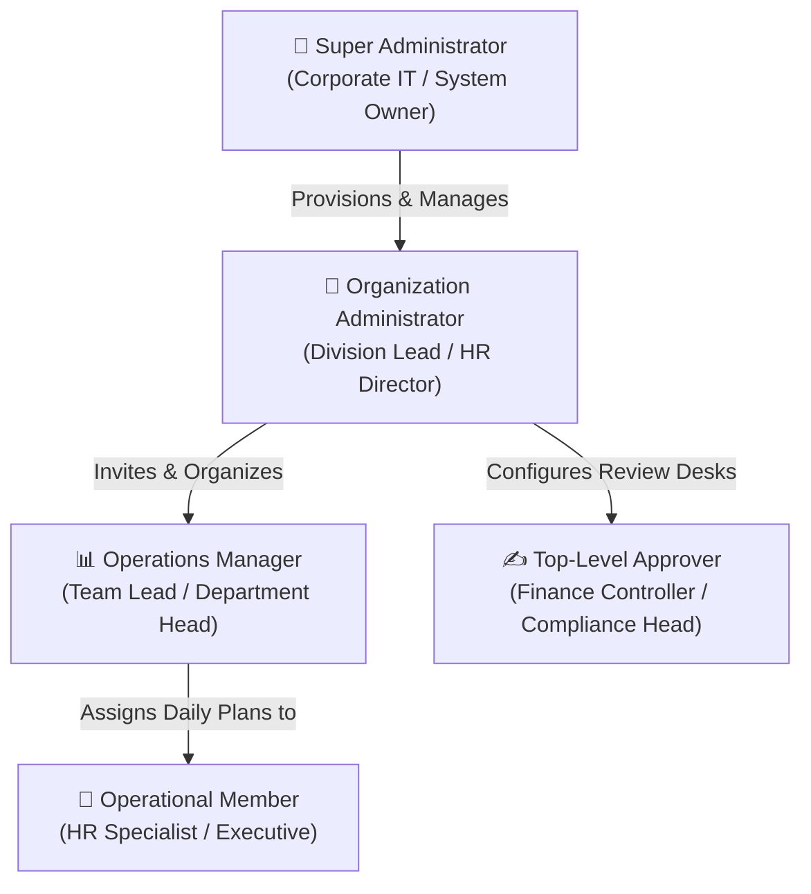
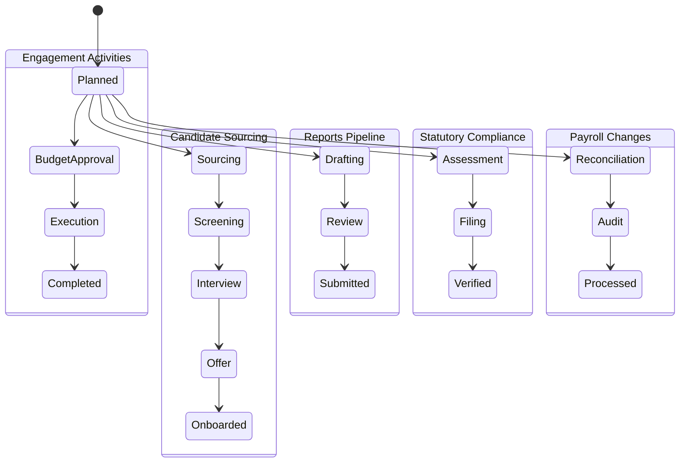
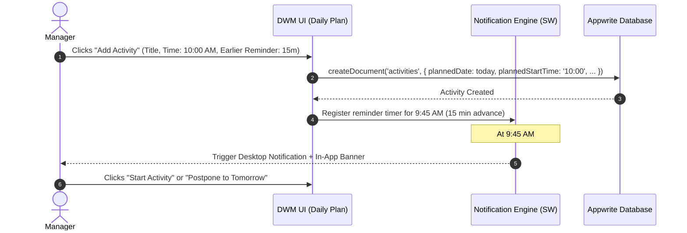
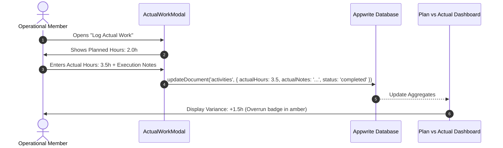
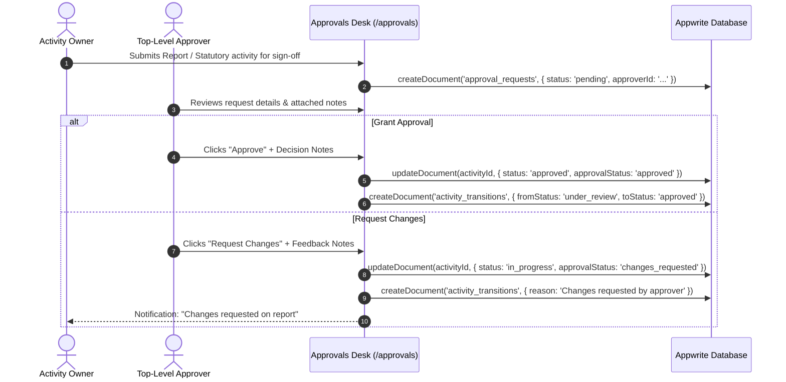
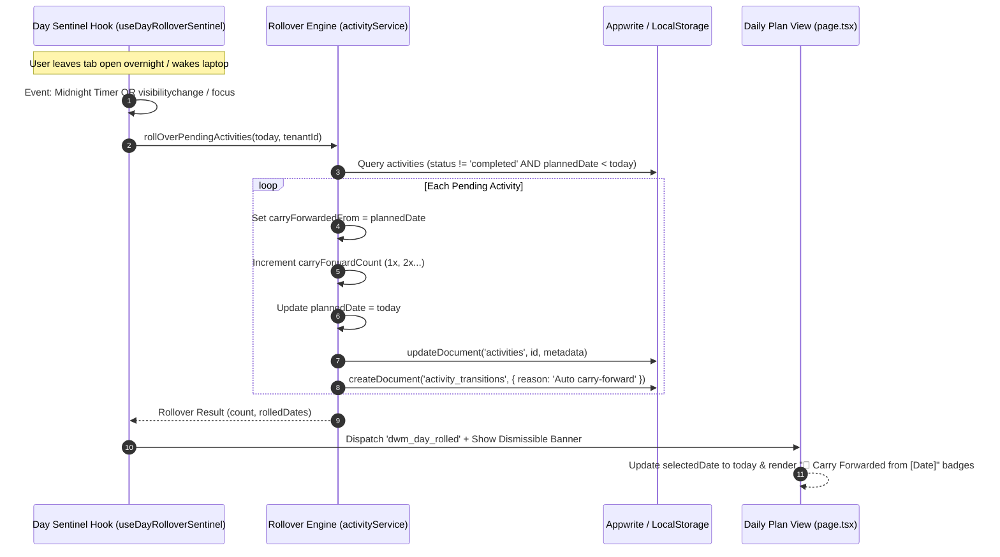

# Product Requirements Document (PRD) & Business Workflows

## 1. Executive Product Overview

The **Daily Work Management (DWM) WorkHub** is an enterprise-grade operational workflow and governance platform designed for high-performance distributed teams. It addresses the common pain points of daily task disorganization, lack of accountability, opaque approval bottlenecks, and untracked aging work items across multi-department pipelines.

### 1.1 Core Problems Solved
- **Daily Task Fragmentation**: Teams start the day without a clear, prioritized agenda.
- **Plan vs Actual Blindspots**: Organizations rarely track whether planned activities were executed on time or how many hours were spent.
- **Approval Bottlenecks**: High-stakes deliverables (statutory filings, payroll changes, offer rollouts) sit in unmonitored email inboxes.
- **Workflow Aging**: Long-pending tasks (>3 days) slip through cracks, risking financial penalties or compliance violations.
- **Multi-Tenant Isolation**: Enterprises require strict separation between corporate divisions while maintaining centralized governance for Super Administrators.

---

## 2. User Personas & Hierarchy

| Persona | Primary Needs & Responsibilities | Key Actions |
| :--- | :--- | :--- |
| **Super Admin** | Platform governance, multi-tenant creation, database & backend configuration | Creates tenants, provisions Appwrite databases, monitors all workspaces |
| **Org Admin** | Tenant team management, role assignments, department structuring | Adds members with 1-click accounts, manages organization settings |
| **Manager** | Pipeline planning, activity oversight, deadline enforcement | Creates daily plans, monitors plan vs actual, assigns tasks to members |
| **Approver** | Sign-off governance, change request reviews, compliance assurance | Reviews pending queue, requests revisions, grants final approvals |
| **Member** | Daily execution, actual hours logging, task completion | Views daily schedule, acknowledges advance reminders, logs actuals |

---

## 3. The 5 Core Operational Pipelines

DWM models enterprise operations into 5 dedicated pipelines, each featuring specific form attributes, stages, and validation rules:

### 3.1 Pipeline 1: Candidate Sourcing & Recruitment
- **Purpose**: Tracks recruitment throughput from candidate identification to onboarding.
- **Attributes**: `candidateName`, `interviewRound` (Screening, Technical, Leadership, HR), `assignedToId`.
- **Key Metric**: Time-to-hire and interview completion rate.

### 3.2 Pipeline 2: Management Reports
- **Purpose**: Governs scheduled operational, financial, and strategic reports.
- **Attributes**: `reportFrequency` (Daily, Weekly, Monthly, Quarterly), `approverRole`, `approverEmail`.
- **Governance**: Requires sign-off before being marked as completed.

### 3.3 Pipeline 3: Statutory & Regulatory Compliance
- **Purpose**: Eliminates compliance penalties for PF (Provident Fund), ESI (Employee State Insurance), TDS (Tax Deducted at Source), Professional Tax (PT), and the Factories Act.
- **Attributes**: `statutoryAct`, `deadline`, `priority` (Urgent / High).
- **Risk Control**: Alerts trigger when approaching deadline with aging status indicators.

### 3.4 Pipeline 4: Payroll Changes & Workflows
- **Purpose**: Handles monthly employee changes affecting payroll.
- **Attributes**: `payrollType` (Addition, Deletion, Separation, Transfer), `department`.
- **Audit Requirement**: Every transition creates an immutable record in `activity_transitions`.

### 3.5 Pipeline 5: Employee Engagement & Culture
- **Purpose**: Coordinates corporate team events, town halls, workshops, and celebrations.
- **Attributes**: `budget`, `venue`, `plannedDate`, `plannedStartTime`.
- **Workflow**: Budget approval required if amount exceeds threshold.

---

## 4. End-to-End Business Workflows

### 4.1 Daily Planning & Advance Reminders Flow

### 4.2 Plan vs Actual Hours & Variance Reconciliation

### 4.3 Top-Level Approvals & Revision Desk

### 4.4 Summaries & Aging Analysis Workflow

The Summaries & Aging dashboard (`/analytics`) continuously aggregates and surfaces stalled items:
- **Long Pending (>3 Days)**:
  - Items planned >3 calendar days ago that remain uncompleted.
  - Automatically flagged with high-visibility red badge and aging counter (e.g. `4 days aging`).
  - Quick action buttons: **Postpone**, **Reassign**, or **Close**.
- **Long Under Processing (>2 Days)**:
  - Deliverables in `Under Review` or `In Progress` stages without status movement for over 48 hours.
  - Tagged with `Stalled Processing` alert to prevent bottlenecks.
- **Timeframe Selector**:
  - Instant toggle between **Weekly View** and **Monthly View**.
  - Category breakdown bars visualising completion rates per pipeline.

### 4.5 Autonomous Continuous & Idle-Resilient Day Rollover Flow
- **Purpose**: Solves the common operational issue where uncompleted activities from yesterday or past days remain stranded in past calendar views.
- **Zero-Cron Architecture**: Self-contained entirely within the client application; requires no external server cron or worker infrastructure.
- **Triggers**:
  1. **Cold Start / Mount**: Runs immediately upon application load.
  2. **Midnight Transition (`00:00:01`)**: Targets the exact microsecond the local clock rolls over into the new day.
  3. **Idle-Tab & Wake Resilience**: Listens to `document.visibilitychange` and `window.focus` when the computer wakes from sleep or the user switches tabs after hours of inactivity.
  4. **Heartbeat Guard**: 60-second periodic heartbeat verifies the current date vs last active date.

---

## 5. Non-Functional Requirements (NFRs)

| Category | Requirement | Target Metric |
| :--- | :--- | :--- |
| **Performance** | Next.js Turbopack compilation & page rendering | <1.5s First Contentful Paint (FCP) |
| **Security** | RBAC validation on all routes and privileged API routes | Super Admin gate on `/settings`, tenant scoping |
| **Accessibility** | Semantic HTML, ARIA dialogs, touch targets ≥48px | WCAG 2.1 AA Compliance |
| **Offline Capability** | Service Worker registration & LocalStorage fallback | App runs in Demo Mode when offline |
| **Test Reliability** | Playwright E2E test coverage across all critical user paths | 100% passing across all 10 suites (39 tests) |
